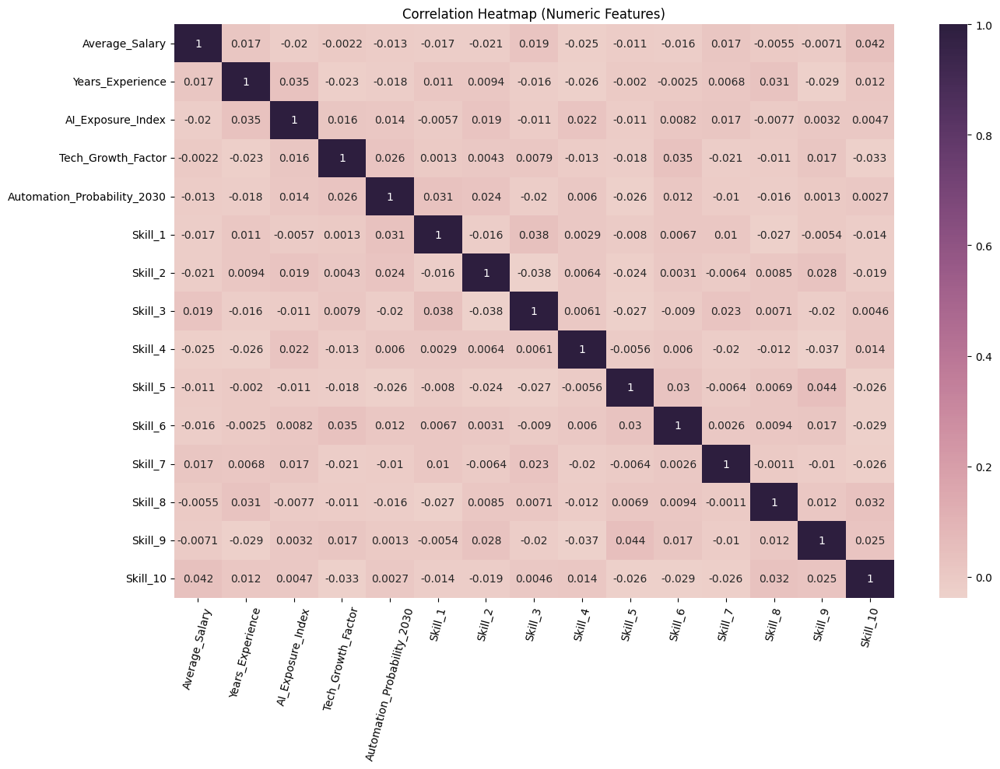
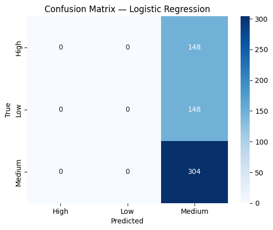
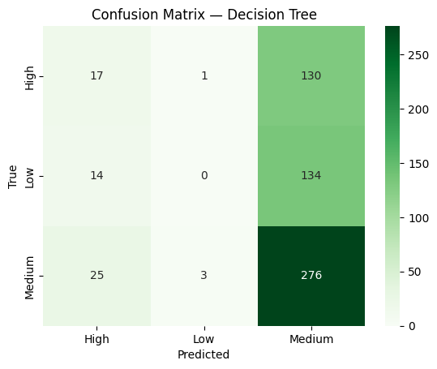
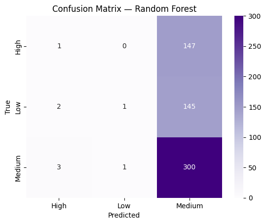
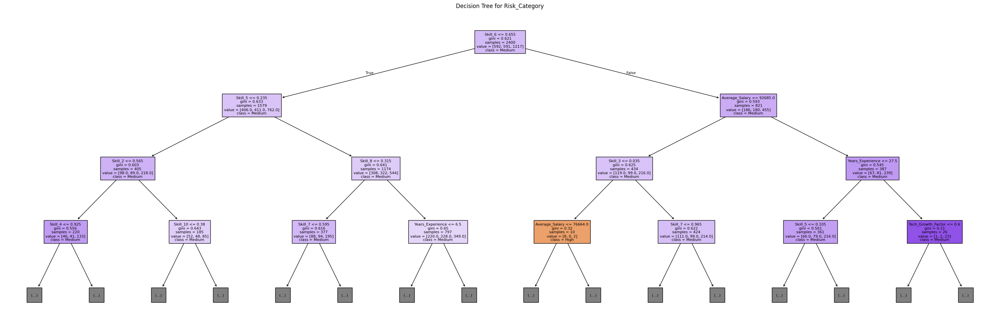

# Forecasting Job Automation Risk Using Machine Learning (2030)

**Author:** Xinyuan Liang  
**Course:** DS201 – Data Science  
**Instructor:** Prof. Dahl  
**Semester:** Fall 2025  

---

## Overview

This project analyzes the **AI Impact on Jobs 2030** dataset to forecast which occupations are at **High**, **Medium**, or **Low** risk of automation.  
Using machine learning techniques-including **Logistic Regression**, **Decision Trees**, and **Random Forests**—the project identifies the factors that contribute most to automation vulnerability.

Key predictors include:
- Skills required  
- Salary  
- Experience  
- AI exposure  
- Technology presence  

The goal is to understand **how AI may reshape the labor market** by 2030.

---

## Project Links

**Google Colab Notebook (Code)**  
https://colab.research.google.com/drive/13_VMVZBbI-6fcg_tZbTshqPJYjKGjy2o?usp=sharing

**YouTube Presentation (4:59)**  
https://youtu.be/QaPizrFGl6M

**Full Report (PDF)**  
https://github.com/Ymeiliangxin/DS201_Final_Project_Xinyuan/blob/main/Final_Project_Report.pdf

---

## Repository Structure

```
DS201_Final_Project_Xinyuan/
│
├── Final_Project_Report.pdf
├── Final_Project_Notebook.ipynb
├── images/                                # Folder with all project figures
│   ├── correlation_heatmap.png
│   ├── logistic_confusion_matrix.png
│   ├── decision_tree_confusion_matrix.png
│   ├── random_forest_confusion_matrix.png
│   ├── feature_importance.png
│   ├── decision_tree_visualization.png
│   └── ...
└── README.md
```

---

## Dataset Overview

The dataset includes:
- Occupation titles  
- Skill requirements  
- Education level  
- Salary  
- Experience  
- Technology presence  
- AI exposure / risk attributes  

---

## Methods

### **1. Data Preparation**
- Handling missing data  
- Data cleaning  
- Encoding categorical features  
- Scaling & transformations  
- Correlation analysis  

### **2. Models Used**
- **Logistic Regression**
- **Decision Tree Classifier**
- **Random Forest Classifier**

### **3. Evaluation Metrics**
- Accuracy  
- Precision  
- Recall  
- F1-score  
- Confusion matrices  

---

## Key Visualizations

### Correlation Heatmap


### Logistic Regression Confusion Matrix


### Decision Tree Confusion Matrix


### Random Forest Confusion Matrix


### Feature Importance (Tree-Based Models)


### Decision Tree Visualization


---

## Findings & Insights

### **Random Forest performed best overall**, offering the most balanced accuracy across all classes.

### **Decision Tree minimized false negatives for high-risk jobs**, making it the best model for policy decisions focused on identifying vulnerable occupations.

### Strongest predictors of automation risk:
- Skill specialization  
- Salary level  
- Exposure to AI technologies  
- Required experience  

### **Low-skill and routine-intensive jobs** showed the highest predicted automation risk.

---

## How to Run the Code

1. Open the Colab link:  
   https://colab.research.google.com/drive/13_VMVZBbI-6fcg_tZbTshqPJYjKGjy2o?usp=sharing

2. Go to **Runtime -> Run all**  
3. All visualizations will be generated automatically  

---

## Contact

If you have questions or would like to discuss the project, feel free to reach out:  
**Xinyuan Liang — Lafayette College**

---

# Thank you for reviewing this project!

